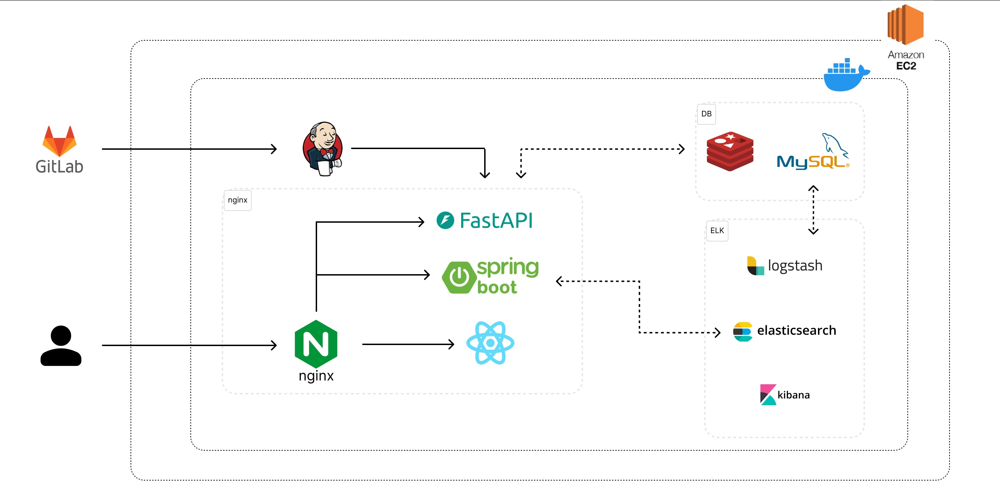

# Coursefree

## 🖥 프로젝트 소개

> 사용자 성향을 기반으로 맞춤형 데이트 코스를 추천해주고 생성해주는 서비스
> 

커플들이 데이트 코스를 계획할 때 활용하는 매체를 조사한 결과에서 SNS매체(35%), 블로그(28%), 지인 추천(16%), 인터넷 카페(10%), 기타(11%)의 수치를 확인할 수 있었습니다.
해당 매체들은 개인의 성향이 고려된 결과를 반환해주는 매체가 아니기 때문에 사용자는 원하는 결과를 얻기 위해 몇 번의 검색을 반복하여야 합니다.

이 프로젝트는, 커플이 개인의 성향이 고려된 데이트 코스를 추천받을 수 있는 서비스를 제공하고 있으며, 크게 다음과 같은 7가지 기능을 갖고 있습니다.

1. 회원 정보 & 성향 정보 입력
2. 커플 연결 기능
3. 코스 제작 기능
4. 코스 추천 기능
5. 코스 최신순 / 조회순 조회 기능
6. 코스 찜 기능
7. 내 코스 조회 기능

---

## 목차

## 📆 개발 기간

- 24.02.26 ~ 24.04.03

## 🙎 멤버 구성

### FE

- 박희준: 회원(회원가입, 로그인), 코스(코스 추천, 코스 제작), 게시글, 댓글
- 백진규: 검색 페이지, 찜 목록 페이지, 마이페이지

### BE

- 김은비 : 회원(로그인, 프로필, 찜한 데이트 코스 조회), 커플(커플 연동, 커플 해제)
- 박세헌 : 게시글, 댓글 API 개발
- 손현조 : 데이트 코스 생성, 추천 알고리즘, 장소 제공
- 이경태 : 일정, 검색 자동 완성, 커플 기록, 사진첩

### INFRA

- 박세헌 : EC2, 도커, nginx를 통해 프로젝트 배포, Jenkins를 통해 CI/CD 구축
- 이경태 : MySQL, Redis, ELK Stack 환경 구축

### DATA

- 백진규 : 방문 시설 자료 전처리 및 크롤링, 식당 추천 알고리즘 구현

## 아키텍쳐



## 실행화면
### 1. 회원 정보 & 성향 정보 입력


### 2. 커플 연결 기능


### 3. 코스 제작 기능
#### 3-1. 직접 제작


#### 3-2. 추천 자동 제작 기능


### 4. 코스 추천 기능


### 5. 코스 최신순 / 조회순 조회 기능


### 6. 코스 찜 기능
#### 4와 5번 실행화면에서 확인 가능

### 7. 내 코스 조회 기능


## Build

```sh
# clone
git clone https://lab.ssafy.com/s10-bigdata-recom-sub2/S10P22A603.git
cd S10P22A603

##################################
# 빌드 및 실행 전 아래 파일 필요
# 1. backend/.env
# 2. frontend/.env
# 3. bigdata/config.ini
##################################
# build all
docker-compose up -d

# only backend build
docker-compose up -d backend
# only frontend build
docker-compose up -d frontend
# only bigdata build
docker-compose up -d bigdata
```

### DB(MySql, Redis)와 elk, nginx 설정은 포팅메뉴얼 참고
